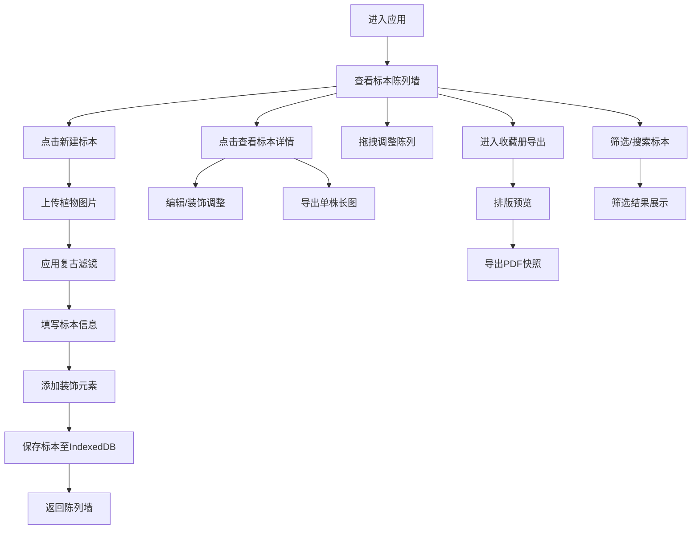

## 1. 产品概述

复古植物标本电子收藏工具，为植物爱好者、自然爱好者、文艺创作者打造的纯本地离线标本管理应用。用户可将实拍花草图片一键处理为复古压花效果，搭配手写随笔与装饰元素，构建个人专属的电子标本收藏册。

- 核心价值：将自然采集的美好瞬间以复古文艺的形式永久珍藏，融合数字技术与手作温度
- 目标用户：植物爱好者、手工爱好者、文艺青年、自然教育工作者

## 2. 核心功能

### 2.1 用户角色

| 角色 | 注册方式 | 核心权限 |
|------|----------|----------|
| 收藏者 | 无需注册，纯本地使用 | 标本录入、编辑、装饰、检索、导出全部功能 |

### 2.2 功能模块

1. **标本录入模块**：图片上传、复古滤镜处理（干花褪色、压纸效果）
2. **标本信息卡模块**：植物名称、采集地点、季节、手写随笔、花期标签
3. **标本陈列墙模块**：网格平铺展示、拖拽自由调整位置
4. **分类检索模块**：按季节/植物类型/生长环境多维筛选
5. **标本装饰模块**：枯叶、麻绳、牛皮纸边框、手写贴纸拖拽摆放
6. **导出模块**：单株长图导出、整套收藏册PDF快照

### 2.3 页面详情

| 页面名称 | 模块名称 | 功能描述 |
|---------|---------|---------|
| 首页/陈列墙 | 顶部导航栏 | 主题切换（日间/林间模式）、新建标本按钮、筛选工具栏 |
| 首页/陈列墙 | 陈列网格区 | 标本卡片网格展示，支持拖拽排序，纸张褶皱动画 |
| 首页/陈列墙 | 侧边筛选栏 | 季节筛选（春夏秋冬）、类型筛选（草本/木本）、环境筛选（山野/庭院） |
| 标本编辑页 | 图片处理区 | 上传图片、Canvas滤镜预览、一键复古效果切换 |
| 标本编辑页 | 信息填写区 | 植物名称、采集地点、季节选择、花期标签、手写随笔输入 |
| 标本编辑页 | 装饰画布区 | 拖拽装饰元素（枯叶/麻绳/边框/贴纸）自由摆放 |
| 标本编辑页 | 操作栏 | 保存、预览、导出单株长图、删除 |
| 收藏册导出页 | 预览区 | 多标本排版预览、翻页过渡动画 |
| 收藏册导出页 | 导出设置 | 纸张样式、封面标题、导出PDF |

## 3. 核心流程

## 4. 用户界面设计

### 4.1 设计风格

- **主色调**：低饱和草木色系
  - 日间模式：米白底色 `#F5F1E8`、苔藓绿 `#7A8B6F`、枯叶棕 `#A68B5B`、干花褐 `#8B7355`
  - 林间模式：深墨绿 `#1E2A24`、森林绿 `#2D4A3E`、雾霭灰 `#5A6B62`、暖木棕 `#6B5B4E`
- **点缀色**：朱砂红 `#B5533F`（印章/标记用）、日光金 `#D4A853`（标题/装饰线）
- **按钮风格**：圆角矩形、微立体阴影、悬停轻微上浮、木纹/纸张纹理
- **字体**：
  - 标题/手写体：「Ma Shan Zheng」或「ZCOOL KuaiLe」中文手写风格字体
  - 正文：「Noto Serif SC」衬线体，营造古籍印刷质感
- **布局风格**：卡片式布局，仿标本册纸张质感，错落有致的不对称陈列
- **图标风格**：手绘线条风，植物叶蔓装饰元素

### 4.2 页面设计概述

| 页面名称 | 模块名称 | UI 元素 |
|---------|---------|--------|
| 陈列墙 | 顶部导航 | 仿皮质标题栏、木纹按钮、手写体Logo、模式切换滑块 |
| 陈列墙 | 标本卡片 | 牛皮纸底色、细微褶皱纹理、手写标签贴纸感、麻绳装饰边角 |
| 陈列墙 | 筛选栏 | 仿老书签样式标签、四季植物小图标、木本/草本分类 |
| 标本编辑页 | 图片处理区 | 仿相纸白边、Canvas预览、滤镜切换为复古小图标按钮 |
| 标本编辑页 | 信息区 | 横线笔记本样式输入框、印章式季节标签、胶带贴纸感输入框 |
| 标本编辑页 | 装饰区 | 底部素材抽屉、拖拽时半透明跟随、吸附对齐参考线 |
| 导出页 | 预览区 | 翻书3D效果、纸张阴影、装订线装饰 |

### 4.3 响应式设计

- 桌面端优先（≥1280px）：多栏布局，侧边筛选常驻，陈列墙3-4列网格
- 平板端（768-1279px）：筛选栏折叠为顶部下拉，陈列墙2列网格
- 移动端（<768px）：单列瀑布流，底部操作栏，触控优化拖拽
- 触控优化：长按触发拖拽，边缘滑动切换标本，双指缩放装饰元素

### 4.4 动效设计指南

- **纸张褶皱细微动画**：卡片加载时CSS `background-position` 渐变位移，营造纸张自然舒展感
- **翻页过渡**：使用CSS 3D `perspective` + `rotateY` 实现轻柔翻书效果，持续600ms，`ease-in-out` 缓动
- **拖拽反馈**：被拖拽卡片轻微放大+投影加深，目标位置虚线占位框呼吸闪烁
- **悬停效果**：卡片 `translateY(-2px)` + 阴影柔和扩散，手写标签轻微倾斜
- **林间模式切换**：主题色渐变过渡500ms，背景纹理轻微变化，营造日落林间氛围
- **装饰元素动画**：枯叶素材自然轻微摇摆，麻绳素材缓慢蜿蜒呼吸
