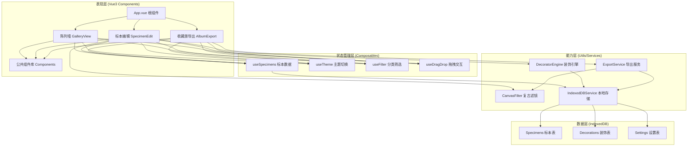

## 1. 架构设计



## 2. 技术栈说明

- **前端框架**：Vue 3.4 + TypeScript 5 + Vite 5
- **构建工具**：Vite 5（快速冷启动、HMR热更新）
- **路由**：Vue Router 4（Hash模式，纯本地无后端）
- **状态管理**：Vue Composition API + Pinia（轻量响应式）
- **样式方案**：CSS Variables + SCSS（主题变量驱动）
- **图像处理**：原生 Canvas 2D API（像素级滤镜处理）
- **本地存储**：IndexedDB（idb 封装库，大容量存储图片Blob）
- **导出能力**：
  - 图片导出：Canvas → toDataURL/toBlob
  - PDF导出：jsPDF + html2canvas
- **拖拽交互**：原生 HTML5 Drag & Drop API + 自定义触控适配
- **字体资源**：Google Fonts（Ma Shan Zheng 手写体、Noto Serif SC 衬线体）

## 3. 路由定义

| 路由路径 | 页面组件 | 用途 |
|---------|---------|------|
| `/` | GalleryView | 标本陈列墙首页，网格展示+筛选+拖拽排序 |
| `/specimen/new` | SpecimenEdit | 新建标本，上传图片+滤镜+填写信息+装饰 |
| `/specimen/:id` | SpecimenEdit | 编辑已有标本，支持修改和重新装饰 |
| `/album/export` | AlbumExport | 收藏册导出页，预览排版+导出PDF |

## 4. 数据模型

### 4.1 数据模型定义 (ER图)

```mermaid
erDiagram
    SPECIMEN {
        number id PK "自增主键"
        string name "植物名称"
        string imageData "原图Base64/Blob引用"
        string filteredImage "滤镜处理后图像"
        string location "采集地点"
        string season "季节: spring/summer/autumn/winter"
        string plantType "类型: herbaceous/woody"
        string environment "环境: mountain/courtyard"
        string bloomPeriod "花期标签"
        string notes "手写随笔"
        number positionX "陈列墙X坐标"
        number positionY "陈列墙Y坐标"
        number sortOrder "排序权重"
        string decorations JSON "装饰元素数组"
        datetime createdAt "创建时间"
        datetime updatedAt "更新时间"
    }
    
    SETTING {
        string key PK "设置项键"
        string value "设置项值"
    }
```

### 4.2 IndexedDB Schema

```typescript
// IndexedDB 数据库名与版本
const DB_NAME = 'HerbariumDB';
const DB_VERSION = 1;

// Object Store 定义
interface SpecimenRecord {
  id?: number;
  name: string;
  imageBlob: Blob;
  filteredImageBlob: Blob;
  location: string;
  season: 'spring' | 'summer' | 'autumn' | 'winter';
  plantType: 'herbaceous' | 'woody';
  environment: 'mountain' | 'courtyard' | 'other';
  bloomPeriod: string[];
  notes: string;
  positionIndex: number;
  decorations: DecorationItem[];
  createdAt: Date;
  updatedAt: Date;
}

interface DecorationItem {
  id: string;
  type: 'leaf' | 'rope' | 'frame' | 'sticker' | 'tape';
  src: string;
  x: number;
  y: number;
  width: number;
  height: number;
  rotation: number;
  zIndex: number;
  opacity: number;
}

interface SettingRecord {
  key: 'theme' | 'displayMode' | 'gridColumns';
  value: string;
}

// 索引配置
// specimens: [id(主键), season, plantType, environment, createdAt]
// settings: [key(主键)]
```

## 5. 模块目录结构

```
src/
├── assets/                    # 静态资源
│   ├── fonts/                 # 字体文件
│   ├── images/                # 装饰素材图（枯叶/麻绳/边框/贴纸）
│   └── textures/              # 纸张纹理/噪点图
├── components/                # 公共组件
│   ├── layout/
│   │   ├── AppHeader.vue      # 顶部导航栏
│   │   ├── ThemeToggle.vue    # 主题切换
│   │   └── SideFilter.vue     # 侧边筛选栏
│   ├── specimen/
│   │   ├── SpecimenCard.vue   # 标本卡片
│   │   ├── FilterCanvas.vue   # 滤镜画布
│   │   ├── DecorationCanvas.vue # 装饰画布
│   │   ├── InfoForm.vue       # 信息填写表单
│   │   └── DecorationDrawer.vue # 装饰素材抽屉
│   └── common/
│       ├── PaperCard.vue      # 纸张质感卡片容器
│       ├── BookMarkTag.vue    # 书签式标签
│       └── SealStamp.vue      # 印章组件
├── composables/               # 组合式函数
│   ├── useSpecimens.ts        # 标本CRUD与状态
│   ├── useTheme.ts            # 日间/林间主题
│   ├── useFilter.ts           # 分类筛选逻辑
│   ├── useCanvasFilter.ts     # Canvas滤镜算法
│   ├── useDragDrop.ts         # 拖拽排序
│   └── useIndexedDB.ts        # IndexedDB封装
├── services/                  # 业务服务
│   ├── IndexedDBService.ts    # 本地存储服务
│   ├── CanvasFilterService.ts # 复古滤镜服务
│   ├── ExportService.ts       # 导出服务（长图/PDF）
│   └── DecorationService.ts   # 装饰元素管理
├── types/                     # TypeScript类型
│   ├── specimen.ts
│   ├── decoration.ts
│   └── index.ts
├── views/                     # 页面视图
│   ├── GalleryView.vue        # 陈列墙首页
│   ├── SpecimenEdit.vue       # 标本编辑页
│   └── AlbumExport.vue        # 收藏册导出页
├── styles/                    # 全局样式
│   ├── variables.scss         # CSS变量（主题色/尺寸）
│   ├── animations.scss        # 动画关键帧
│   ├── mixins.scss            # SCSS混入
│   └── global.scss            # 全局样式
├── router/                    # 路由
│   └── index.ts
├── App.vue
└── main.ts
```

## 6. 核心算法/处理流程

### 6.1 Canvas 复古滤镜算法
```
1. 干花褪色效果 (PressedFlowerFilter):
   - 降低饱和度 40-60%
   - 亮度微调 -5%
   - 色偏调整：R通道-10, G通道+5, B通道-15（偏枯黄）
   - 添加胶片颗粒噪点（噪点强度 0.08）
   - 边缘暗角 vignette 效果

2. 压纸复古效果 (AgedPaperFilter):
   - 图像与牛皮纸纹理 multiply 混合
   - 对比度降低 15%
   - 色调分离：高光偏暖黄，阴影偏褐
   - 添加折痕阴影（基于SVG位移图）

3. 参数化调用:
   filterPipeline = [
     desaturate(0.5),
     colorShift({r:-10, g:5, b:-15}),
     blendTexture(paperTexture, 'multiply', 0.6),
     addNoise(0.08),
     vignette(0.3, 0.8)
   ]
```

### 6.2 拖拽排序算法
```
陈列墙网格排序:
1. 计算网格 cellWidth / cellHeight
2. onDragStart: 记录源索引、克隆占位元素
3. onDragOver: 计算鼠标所在网格坐标、交换预测位置
4. onDrop: 更新 sortOrder 数组、持久化到 IndexedDB
5. 动画: 使用 FLIP 技术（First-Last-Invert-Play）60fps过渡
```

### 6.3 装饰元素合成导出
```
1. 构建导出图层栈:
   [背景纸纹] → [滤后标本图] → [装饰元素按zIndex排序] → [信息文字层]
2. 逐图层 drawImage 到离屏 Canvas
3. 文字层使用 Canvas text API 渲染手写字体
4. 导出:
   - 单株长图: canvas.toBlob('image/png', quality=0.95)
   - PDF: 遍历标本 → html2canvas → jsPDF.addImage → save()
```
